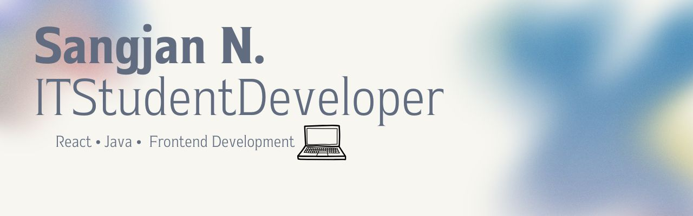

<!-- Banner / Cover -->

  

<h1 align="center">Hi, I’m Sangjan 👋🏻</h1>

  <strong>IT Student • Student Developer</strong> 
  <em>“Learning. Building. Improving.”</em>

---

## 🚀 About Me

🌱 Currently learning React, JavaScript, HTML and CSS

⚛️ Interested in Frontend Development and UI Implementation

💻 Building responsive web applications with React

🛠 Daily stack: React · JavaScript · HTML · CSS · Java 

---

## 🧰 Tech Stack & Tools

| Domain | Primary | Comfortable | Currently Exploring |
|--------|---------|-------------|---------------------|
| Front-end |     | — | — |
| Programming |  | — | — |
| Database |   | — | — |
| Tools |   | — | — |

---

## 📌 Academic Projects

| Project | Tech | Highlights | Links |
|---------|------|-----------|-------|
| **Web Development Projects** | HTML · CSS · React · Tailwind CSS | Built user interfaces and practiced reusable components through coursework | Coming Soon |
| **Java Programming Projects** | Java | Practiced Object-Oriented Programming (OOP), Exception Handling, and File Handling | Coming Soon |

---

## ✍🏻 Learning Journey

🌱 Learning and improving my skills through university projects.

- Practicing front-end development with React
- Improving Java programming fundamentals
- Learning SQL and database concepts
- Developing problem-solving skills through programming exercises

## 📈 GitHub Stats

  
  

## 🤝 Let’s Connect

“Small progress is still progress.”

💌 Email: thirdgaston@gmail.com

🐙 GitHub: [6604106421](https://github.com/6604106421)

  

