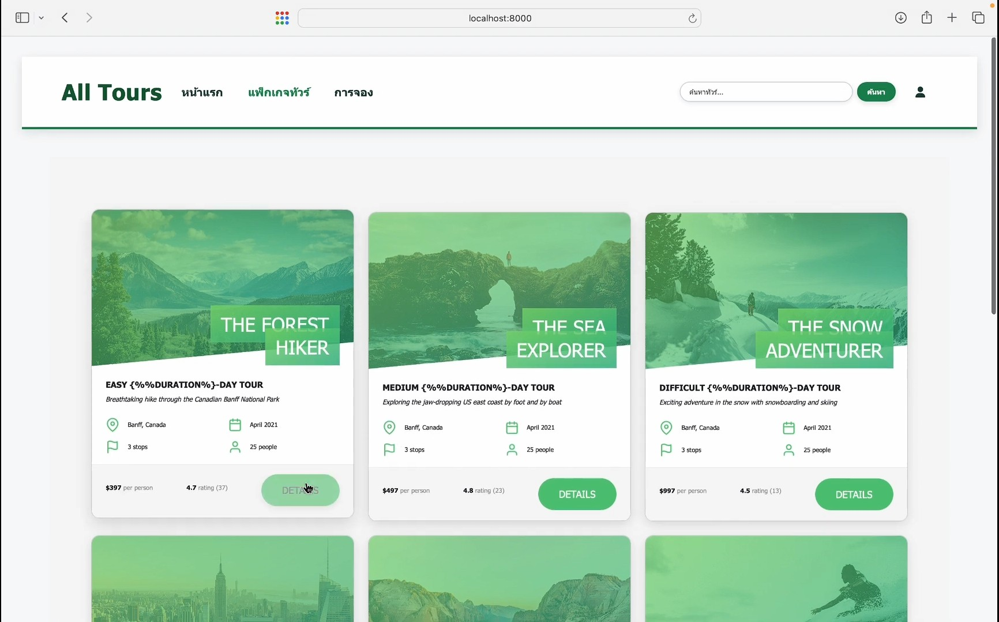

<!-- Banner / Cover -->

  

## 🚀 About Me

🌱 Learning React, JavaScript, Java, Oracle SQL, and Software Testing

⚛️ Interested in Frontend Development and Software Testing

💻 Making web apps and databases through university projects

🛠 Daily stack: React · JavaScript · Java · Oracle SQL · Robot Framework

---

## 🧰 Tech Stack & Tools

| Domain | Primary | Comfortable | Currently Exploring |
|--------|---------|-------------|---------------------|
| **Front-end** |   |   |  |
| **Back-end** |  | — |  — |
| **Data** |   | — | — | 
| **Design & QA** | — |   |  — |
| **DevOps** |   |  |  — | 

---

## 📌 Featured Projects

| Project | Preview | Tech | Highlights | Links |
|---------|---------|------|-----------|-------|
| **Tour Booking Website** |  | HTML · CSS · JS · Node.js | Developed a responsive web application for booking travel tours. Users can explore various tour packages, read details, and submit booking forms. I also created a basic local backend server using Node.js to manage the application's data. | [Repo](#) |
| **Automated Web Testing** | — | Robot Framework · Selenium | Created an automated testing project to check if web applications function properly. I used Robot Framework and Selenium to simulate user actions like clicking and typing. The project also reads test data from Excel files to automatically test web forms. | [Repo](#) |

---

## 📈 GitHub Stats

  
  

---

## 🤝 Let's Connect

> "Small progress is still progress."

💌 Email: thirdgaston@gmail.com

🐙 GitHub: **https://github.com/Sangjan-port**
